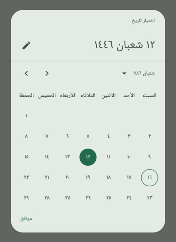
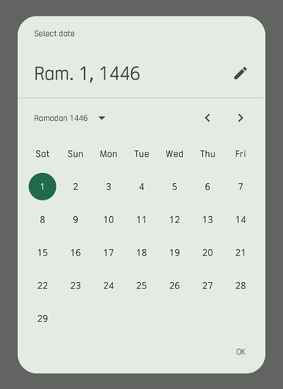
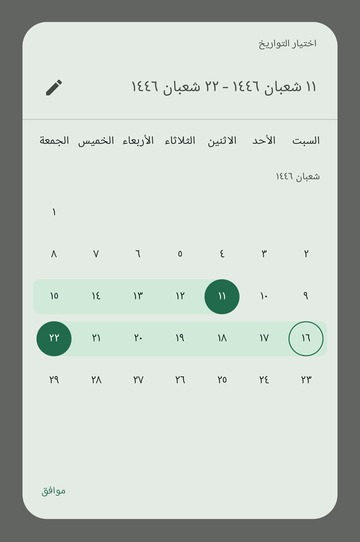
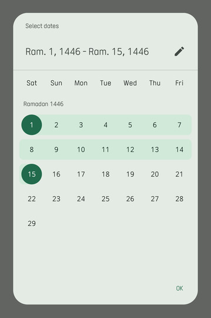

# Hijri Date Picker

[//]: # ([![Version]&#40;https://img.shields.io/badge/Version-1.0.0alpha01-puregreen.svg&#41;]&#40;&#41;)
[]()
[]()
[](https://www.paypal.com/paypalme/AbdulrahmanBahamel)

A modern and customizable Hijri Date Picker for Android, built with Jetpack Compose and inspired by the Material3 Date
Picker.

The Hijri Date Picker allows users to select a date in the Hijri calendar with ease. It is designed to be simple,
flexible, and customizable, making it easy for developers to integrate into their apps and tailor to their needs. This
library addresses the lack of up-to-date and modern date pickers that support the Hijri calendar, providing a
high-quality solution for Muslim users.








## Table of Contents

- [Features](#features)
- [Usage](#usage)
- [Installation](#installation)
- [Support Me](#support-me)

## Features

- **Modern Design**: The Hijri Date Picker is built on top of Material3 components, providing a modern and sleek design
  that fits seamlessly into your app.
- **Customizable**: The Hijri Date Picker is highly customizable, allowing you to change the colors, locale, and other
  properties to match your app's theme.
- **Date Range**: The Hijri Date Picker supports selecting a date range, allowing users to select a start and end date.
- **Text Input**: The Hijri Date Picker includes a text input field that allows users to manually enter a date in the Hijri
  calendar with validation to ensure the date is valid.
- **Interoperability with Java Time API**: The Hijri Date Picker uses [HijrahDate](https://docs.oracle.com/en/java/javase/11/docs/api/java.base/java/time/chrono/HijrahDate.html)
  from the Java Time API to handle Hijri dates, ensuring accuracy and reliability.
- **Material3 Components**: The Hijri Date Picker is built using Material3 components, providing a consistent and
  high-quality user experience.


## Usage

The library provides two main components: `HijriDatePicker` and `HijriDateRangePicker`. As the names suggest, the former is used to select a single date, while the latter is used to select a date range.
Both are pure content composable, they don't wrapped by dialog or bottom sheet, so you can use them in any way you want.

Here's an example of how to use `HijriDatePicker` as a dialog:

```kotlin
val datePickerState = rememberHijriDatePickerState(/* You can customize some properties */)
var selectDateDialogOpen by remember { mutableStateOf(false) }

if (selectDateDialogOpen) {
    DatePickerDialog(
        onDismissRequest = { selectDateDialogOpen = false },
        confirmButton = {
            TextButton(
                onClick = {
                    datePickerState.selectedDate?.let { date: HijrahDate ->
                       //Do something with the selected date
                    }
                    selectDateDialogOpen = false
                },
                content = { Text(stringResource(R.string.ok)) }
            )
        },
    ) {
        HijriDatePicker(state = datePickerState, /* You can customize some appearance properties */)
    }
}

/*
 * Other code, You can show the dialog by setting `selectDateDialogOpen` to true on a button click or any other event
 */
```

And here's an example of how to use `HijriDateRangePicker` as a dialog:

```kotlin
val datePickerState = rememberHijriDateRangePickerState(/* You can customize some properties */)
var selectDateDialogOpen by remember { mutableStateOf(false) }

if (selectDateDialogOpen) {
    DatePickerDialog(
        onDismissRequest = { selectDateDialogOpen = false },
        confirmButton = {
            TextButton(
                onClick = {
                    val selectedRange: SelectedDateRange? = datePickerState.getSelectedDateRange()
                    selectedRange?.let { range: SelectedDateRange ->
                        //Do something with the selected date range
                    }
                    selectDateDialogOpen = false
                },
                content = { Text(stringResource(R.string.ok)) }
            )
        },
    ) {
        HijriDateRangePicker(state = datePickerState /* You can customize some appearance properties */)
    }
}

/*
 * Other code, You can show the dialog by setting `selectDateDialogOpen` to true on a button click or any other event
 */
```

## Installation

This library requires Jetpack Compose and Material3 components, so make sure you have them set up in your project.
The library also requires minimum sdk 26 or higher, and JDK 11 or higher to build and run the dependencies.

- Add the Maven Central repository if it is not already there:

```kotlin
repositories {
    mavenCentral()
}
```

Add the following to your build script:

#### Kotlin DSL
```build.gradle.kts
dependencies {
    implementation("com.abdulrahman-b.hijridatepicker:hijridatepicker:1.0.0-alpha01")
}
```

#### Groovy DSL
```build.gradle
dependencies {
    implementation "com.abdulrahman-b.hijridatepicker:hijridatepicker:1.0.0-alpha01"
}
```

## Support Me

If you like the project and want to support me, you can do so via [PayPal](https://www.paypal.com/paypalme/AbdulrahmanBahamel). Your contributions are greatly appreciated! Thank you for your support!


